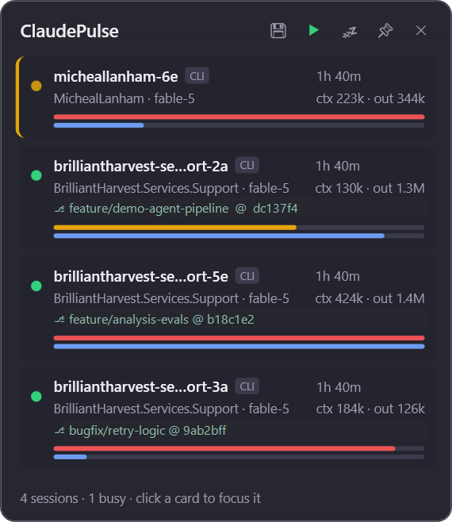

# ClaudePulse

An always-on-top Windows tray widget that monitors your live [Claude Code](https://claude.com/claude-code) sessions: what's running, what's busy, token usage, git branch, and elapsed time — with click-to-focus, reboot recovery, and saved session sets.

 

<p align="center"></p>

## Features

- **Live session list** — every running Claude Code process (CLI and desktop app), polled every 2 seconds from the registry Claude Code maintains in `~/.claude/sessions/`.
- **Status at a glance** — pulsing amber dot + left-edge stripe for busy sessions, green for idle, blue for waiting-on-input, dimmed gray for dormant desktop leftovers. The tray icon dot mirrors the busiest state so you don't even need the panel open.
- **Token usage bars** — per session: context-window fill (green → amber → red) and cumulative output tokens (scaled against your largest session), tailed incrementally from the transcript JSONL.
- **Git awareness** — current branch @ short commit, read directly from `.git` files (no `git.exe` spawned; handles worktrees and detached HEAD).
- **Click-to-focus** — click a session card and the hosting terminal window (Windows Terminal, VS Code, …) comes to the front, found by walking the parent-process chain.
- **Reboot recovery** — continuously records live CLI sessions; after a restart, one click (**↻ Restore**) reopens each one in a Windows Terminal tab via `claude --resume`, in its original folder.
- **Saved session sets** — 💾 remembers your current working arrangement; ▶ relaunches it any time, skipping sessions already running.
- **Hide dormant sessions** — the 💤 header toggle filters out sessions with no activity for 30+ minutes (typically desktop-app leftovers); the footer still counts them, and the choice persists.
- **Quality of life** — `Ctrl+Alt+C` global toggle, single-instance, drag anywhere and the position persists, pin/unpin auto-hide.

## Build & run

```powershell
dotnet build -c Release
.\bin\Release\net9.0-windows\ClaudePulse.exe
```

Requires the .NET 9 SDK and Windows. To start with Windows, put a shortcut to the exe in `shell:startup`.

Single-file distribution:

```powershell
dotnet publish -c Release -r win-x64 --self-contained -p:PublishSingleFile=true
```

## How it works

| Source | What it provides |
|---|---|
| `~/.claude/sessions/<pid>.json` | Live registry: pid, sessionId, cwd, name, status, start time, entrypoint (cli / claude-desktop) |
| `~/.claude/projects/<slug>/<sessionId>.jsonl` | Transcript; each assistant message carries `message.usage` token counts |
| `<cwd>/.git` | Branch and commit, via HEAD / loose refs / packed-refs |
| `%APPDATA%\ClaudePulse\` | Widget settings, reboot-restore snapshot, saved session set |

Sessions are validated against live processes (with PID-reuse guards). Desktop-app sessions never report status, so ClaudePulse infers busy/idle/dormant from transcript activity recency.

## Known limitations

- Windows-only UI (WPF); the data layer (`Services/`) is portable .NET and would move to Avalonia for a cross-platform port.
- Focuses the hosting terminal *window*; can't select the specific Windows Terminal tab (not externally exposed).
- Covers Claude Code only — the Claude.ai chat desktop app keeps no local session files.
- Context-window fill assumes 200k (1M for models advertising `[1m]`); sessions with heavy cache writes can report above 100% and clamp red.
